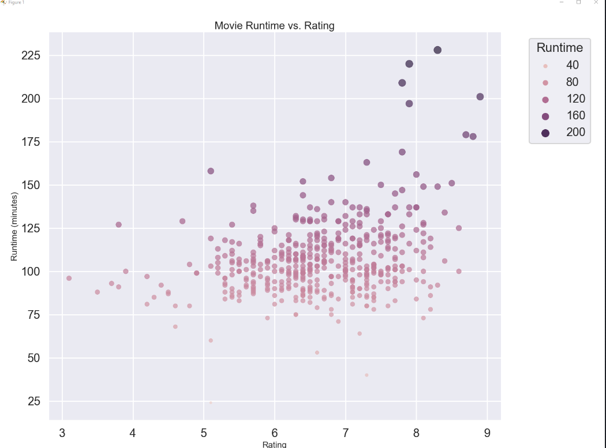

# Movie Data Visualization Project

Analyse and visualise the relationship between movie ratings and runtimes using Python's data analysis libraries.

## Overview

This project explores a dataset of movies to understand patterns in movie runtimes and how they correlate with ratings. By using powerful Python libraries like Pandas, Matplotlib, and Seaborn, the project delves deep into the data, providing a visually appealing and informative representation of the underlying trends.

## Sample Scatter Plot



## Dependencies

Python 3.x
Pandas
Matplotlib
Seaborn

## Setup & Installation

Clone this repository.

1. Clone this repository.
   ```bash
   git clone https://github.com/your_username/your_repository_name.git
   \```
2. Navigate to the project directory.
   ```bash
   cd your_repository_name
   \```
3. (Optional) Create a virtual environment.
   ```bash
   python -m venv venv
   source venv/bin/activate  # On Windows, use `venv\Scripts\activate`
   \```
4. Install the required packages.
   ```bash
   pip install pandas matplotlib seaborn
   ```

Key Insights
The peak of the distribution suggests a mode runtime of approximately 100 minutes for movies in the dataset.
There's a varied spread of runtimes across different ratings, indicating that a movie's length doesn't necessarily correlate with its rating.


